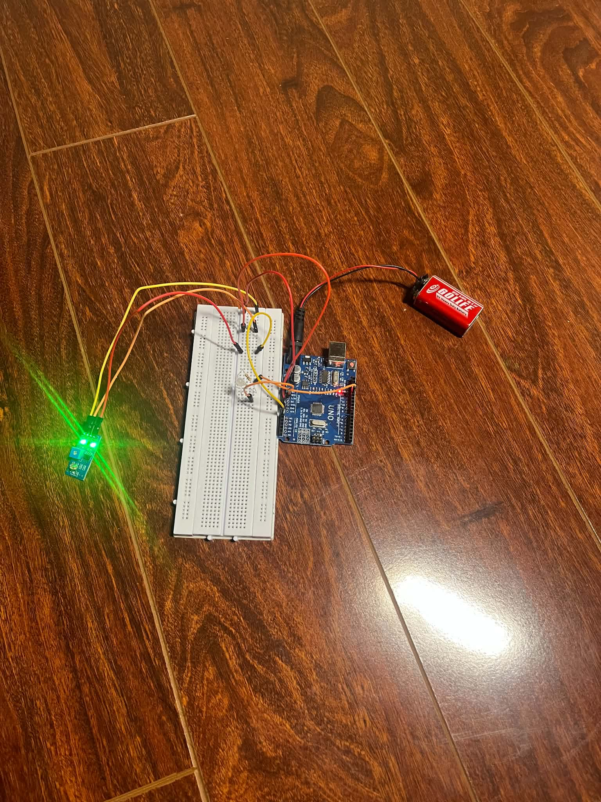

# Smart Street Light System (Arduino)

An automated street light control system built with Arduino UNO. The system automatically turns on the LED light when it detects darkness using a Photoresistor (LDR) sensor and turns it off when ambient light is detected.

---

## 🛠 Hardware Components

Based on the setup shown in `setup.jpg`:

* **1x** Arduino UNO R3
* **1x** LDR (Light Dependent Resistor / Photoresistor) Sensor Module
* **1x** LED Light
* **1x** Resistor
* **1x** Breadboard
* **1x** 9V Battery (Power Supply with Snap Connector)
* Jumper Wires (Male-to-Male / Male-to-Female)

---

## 🔌 Circuit Diagram & Setup

Here is the physical hardware setup for the smart street light project:



### Wiring Details:
* **LDR Sensor Module:**
  * `VCC`: Connected to 5V on Arduino
  * `GND`: Connected to GND on Arduino
  * `DO` (Digital Output) / `AO` (Analog Output): Connected to Arduino Input Pin (e.g., Pin `A0` or `D2`)
* **LED Light:**
  * Anode (+): Connected to Arduino Output Pin (e.g., Pin `13` or `9`) via resistor
  * Cathode (-): Connected to GND
* **Power:**
  * 9V Battery connected to the DC Barrel Jack / VIN on Arduino for standalone operation.

---

## 🚀 How to Run

1. **Clone or Download the Repository:**
   ```bash
   git clone [https://github.com/cktang59/Street-Light.git](https://github.com/cktang59/Street-Light.git)
